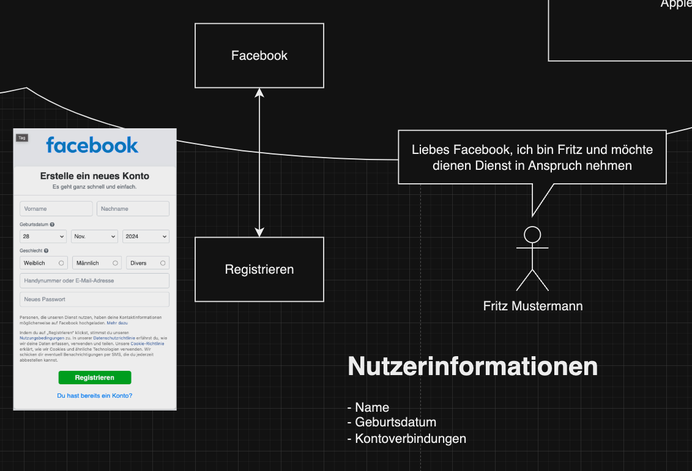
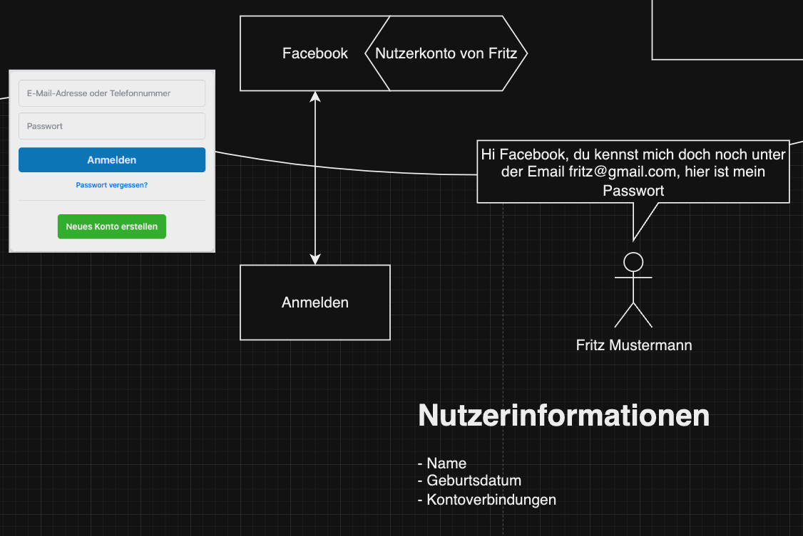

Heute haben wir in unserer Digitalcafé-Session gemeinsam versucht, einen DHL-Paketshop-Service einzurichten. Dabei ist mir aufgefallen, dass es immer noch einige Unsicherheiten gibt: Was genau ist eigentlich ein „Service“, und warum müssen wir uns dafür immer wieder neue Konten und Passwörter merken?

Mit diesem Artikel möchte ich endlich Licht ins Dunkel bringen. Ich werde dir verständlich erklären, warum wir uns registrieren und anmelden müssen, was es mit Passwörtern auf sich hat und wie das alles zusammenhängt. Keine Sorge – Schritt für Schritt wird alles klar!

## Was ist eigentlich ein "Service"?

Ein Service (oder Dienst) ist ein digitales Angebot im Internet, das dir hilft, bestimmte Aufgaben zu erledigen – ähnlich wie ein Geschäft oder eine Dienstleistung in der realen Welt.

### Beispiele für Services:

- [**DHL-Paketservice**](https://www.dhl.de/de/privatkunden.html): Pakete verfolgen oder Zustelloptionen festlegen.
- **Online-Banking**: Geld überweisen oder Kontostand prüfen.
- [**Signal**](https://signal.org/): Nachrichten an Familie und Freunde senden.
- [**Netflix**](https://netflix.de): Filme und Serien streamen.

### Warum brauchst du für jeden Service ein eigenes Konto?

Jeder Service benötigt ein eigenes Konto, damit:

- _Sicherheit_: Nur du hast Zugriff auf deine persönlichen Daten.
- _Personalisierung_: Der Dienst kann deine Einstellungen und Aktivitäten speichern.
- _Schutz bei Problemen_: Wenn ein Konto gehackt wird, sind die anderen nicht betroffen.

Das mag zwar etwas umständlich wirken, aber es erhöht die Sicherheit. Wenn ein Konto von jemand anderen übernommen worden ist, bleiben deine anderen Konten geschützt.

> 💡 **Gut zu wissen:**
>
> - Speichere deine Zugangsdaten sicher, zum Beispiel in einem Passwortmanager wie Apples Schlüsselbund oder 1Password.
> - Alternativ kannst du ein spezielles Notizbuch für Internet-Zugänge verwenden.

## Was bedeutet „Registrieren“?

„Registrieren“ bedeutet, ein neues Konto zu erstellen – sozusagen deinen „digitalen Ausweis“.

Was du dabei angeben musst:

- Meistens deinen Namen.
- Eine E-Mail-Adresse oder Telefonnummer.
- Ein Passwort – das sollte sicher sein, aber auch leicht für dich zu merken.

Wenn du dich registrierst, legst du fest, wie du dich später ausweisen möchtest.

### Das brauchst du für die Registrierung:

- ✓ Eine E-Mail-Adresse
- ✓ Ein sicheres Passwort (Prüfe dein Passwort hier: [Passwort Tester](https://checkdeinpasswort.de/))
- ✓ Manchmal deine Telefonnummer
- ✓ Eventuell deinen Namen und Adresse

## Was bedeutet „Anmelden“?

Sobald du ein Konto hast, kannst du dich „anmelden“. Das ist wie das Vorzeigen deines Bibliotheksausweises: Du gibst deinen Benutzernamen (oder deine E-Mail-Adresse) und dein Passwort ein, und schon weiß der Service, dass du es bist.

_Ein Beispiel:_
Du hast ein Konto bei [Otto](https://www.otto.de/). Wenn du dich anmeldest, kannst du sehen, was du bestellt hast, oder neue Sachen einkaufen.

## Was bedeutet „Anmelden über Google“?

Manchmal hast du die Möglichkeit, dich mit deinem Google-Konto anzumelden. Das bedeutet, dass du kein neues Konto erstellen musst – du nutzt einfach dein Google-Profil.

_Warum das praktisch ist:_

- _Schneller Einstieg_: Du sparst Zeit bei der Registrierung.
- _Weniger Passwörter merken_: Du benötigst kein zusätzliches Passwort.

Ein Beispiel:
Die App [Bring](https://bring.de) ist eine Einkaufslisten App die ich sehr empfehlen kann. Hier gibt es den Knopf "Anmelden über Google" das ermöglicht dir ganz einfach ein Konto zu erstellen ohne ein neues Passwort zu vergeben.



### Datenschutzaspekte

Vielleicht fragst du dich, welche Daten dabei geteilt werden und ob das sicher ist. Wenn du dich über Google anmeldest, erhält der neue Dienst bestimmte Informationen von deinem Google-Konto:

- Deinen Namen
- Deine E-Mail-Adresse
- Dein Profilbild (falls vorhanden)

**_Wichtig zu wissen:_**

- Nur notwendige Daten werden geteilt. Du kannst oft auswählen, welche Informationen du weitergeben möchtest.
- Dein Passwort bleibt geheim. Der Dienst erhält keinen Zugriff auf dein Google-Passwort oder andere sensible Daten.

**_Sicherheitsvorteile:_**

- **Einfachheit**: Du musst dir weniger Passwörter merken.
- **Zusätzliche Sicherheit**: Du profitierst von den Sicherheitsfunktionen deines Google-Kontos, wie der Zwei-Faktor-Authentifizierung.

**_Mögliche Bedenken:_**

- **Zentralisierung**: Wenn jemand Zugriff auf dein Google-Konto erhält, könnte er auch auf die verknüpften Dienste zugreifen. Daher ist es wichtig, dein Google-Konto gut zu schützen.
- **Datenschutz**: Manche Menschen möchten ihre Daten nicht mit großen Anbietern wie Google teilen.

### Alternativen, wenn „Anmelden über Google“ nicht klappt oder du es nicht möchtest

- Direkte Registrierung beim Dienst:
  - Neues Konto erstellen: Gib deine E-Mail-Adresse und ein neues Passwort ein.
  - Mehr Kontrolle über deine Daten: Du entscheidest, welche Informationen du angibst.
- Anmeldung über andere Anbieter:
  - Einige Dienste bieten die Anmeldung über andere Plattformen an, wie Facebook oder Apple.

_Vorteile der direkten Registrierung:_

- **Unabhängigkeit von Drittanbietern**: Deine Daten sind nur bei dem jeweiligen Dienst gespeichert.
- **Datenschutz**: Du teilst weniger persönliche Informationen mit großen Konzernen.
- **Flexibilität**: Du kannst unterschiedliche Passwörter und Sicherheitsstufen für verschiedene Dienste verwenden.

## Warum klappt „Anmelden über Google“ manchmal nicht?

Nicht jede Webseite oder App unterstützt die Anmeldung über Google. Gründe können sein:

- Der Anbieter hat keine Partnerschaft mit Google.
- Dein Google-Konto ist nicht richtig eingerichtet.
- Manche Webseiten erlauben es aus Sicherheitsgründen nicht.

---

## Quiz

Perfekt, bis hier hin sollte das erstmal reichen. Falls du möchtest kannst du hier noch einmal dein gelerntes testen und schauen ob du alles verstanden hast.

### 1. Du möchtest ein Konto bei einem Online-Shop erstellen.

_Was machst du?_

- Anmelden
- Registrieren


Die Antwort ist: <b>Registrieren</b>


### 2. Du hast schon ein Konto und willst es nutzen.

_Was machst du?_

- Anmelden
- Registrieren


Die Antwort ist: <b>Anmelden</b>


### 3. Du siehst die Option „Mit Google anmelden“.

_Was machst du?_

- Mit Google anmelden
- Ein neues Konto erstellen


Die Antwort ist: <b>Mit Google anmelden</b>


## 4. Du kannst dich nicht mit Google anmelden.

Warum?

- Der Service unterstützt es nicht.
- Mein Passwort ist falsch.


Die Antwort ist: <b>Der Service unterstützt es nicht.</b>


---

## Noch Fragen?

Du siehst, dass Konten und Dienste wie digitale Schlüssel zu deinen Online-Aktivitäten sind. Mit etwas Übung wirst du dich schnell zurechtfinden. Denk immer daran:

- **Nimm dir Zeit**: Es ist völlig in Ordnung, dir beim Einrichten von Konten Zeit zu lassen.
- **Notiere wichtige Zugangsdaten sicher**: Schreibe deine Benutzernamen und Passwörter an einem sicheren Ort auf.
- **Frag nach Hilfe**, wenn du unsicher bist: Zögere nicht, Freunde, Familie oder Experten um Unterstützung zu bitten.

Mit Geduld und Übung wirst du die digitale Welt meistern und ihre vielen Vorteile genießen können. Du bist nicht allein auf diesem Weg!
